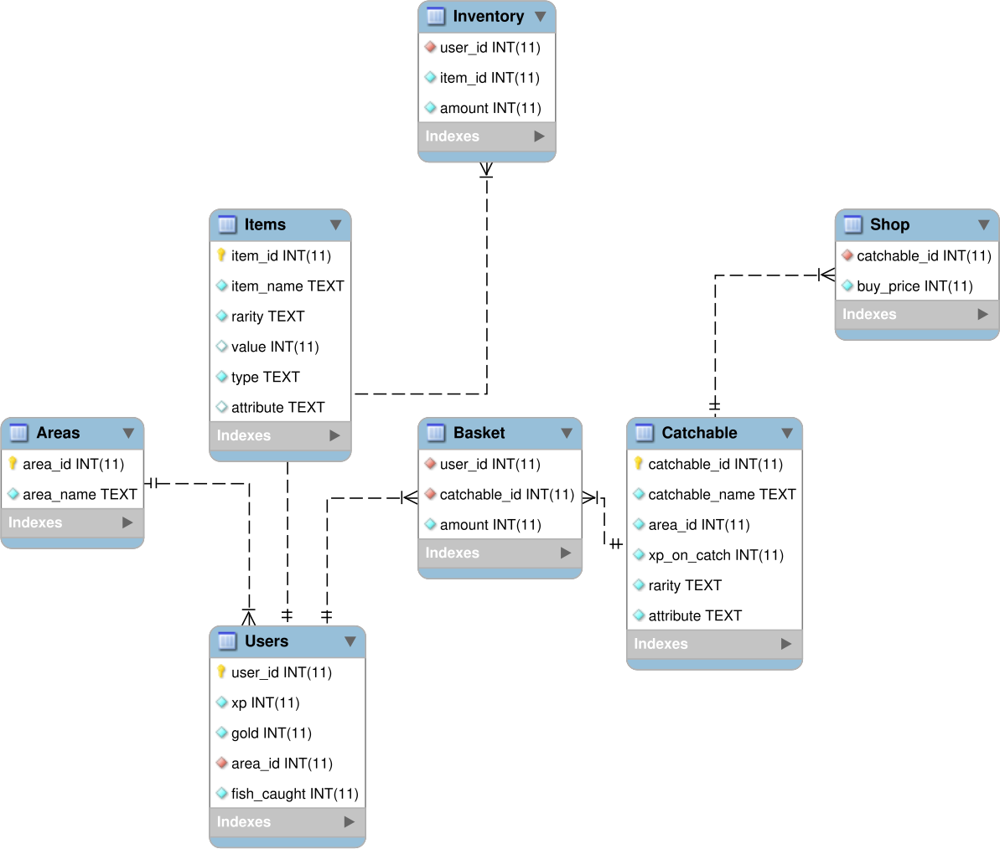
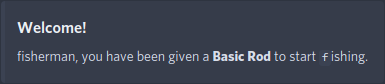
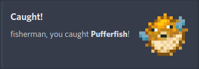
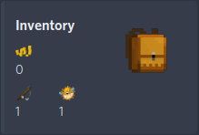
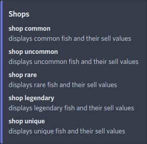
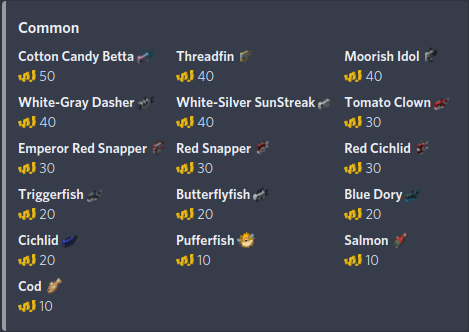
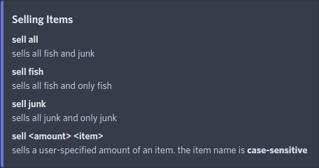

# FISHERBOT - A Fun Fishing Bot for Discord
## Problem Description
Over the years I wanted to create a fun and interactive incremental mobile game. The issue with creating such a game is the complexity. Making a mobile app is out of my expertise, not to mention user account security or hosting a server open to the internet. It's simply way too much.

I would like a system where I don't have to host anything on an open server. This is to prevent having my home network from being open to the internet, since I'm not comfortable with incoming connections from random individuals to my home IP address. If someone wants to, they can be extremely malicious and leak personal information using that address.

The system also needs to be secure for the users. I do not trust myself fully when it comes to securing a user's data in the event of a required password recovery or password reset, so avoiding this entire situation would be ideal. Users should be able to use this bot by creating a Discord account and joining my Discord server. This passes all security concerns to Discord. With this, each user is just their user ID rather than a user:pass combination.

Finally, the system needs to be self-contained. It should be portable since I plan to move it around to different hosting computers. This means everything needs to work with as few dependencies as possible and all within one folder. 

## Database Design
The following information is to understand and potentially rebuild the database in the event the source code is lost.
 1. *Users*: The main attributes are user identification number, experience, gold, current area, and number of fish caught.
 2. *Items*: The main attributes are item identification number, item name, rarity, gold value, type of item, and item attribute.
 3. *Catchable*: The main attributes are catchable identification number, catchable name, catchable area identification number, experience gain on catch, rarity, and catchable attribute.
 4. *Areas*: The main attributes are area identification number and area name.
 5. *Inventory*: The main attributes are user identification number, item identification number, and amount of an item.
 6. *Basket*: The main attributes are user identification number, catchable identification number, and amount of a catchable.
 7. *Shop*: The main attributes are catchable identification number and the shop buy price of the catchable.

 
 

 

## Access Application Development
The following are a list of information queries, boolean queries, and insert and update forms created to interface between the database and the application. They are all written in Python.

### Information Queries
These queries return a table or a value from a table.
 * *UserData*: returns all columns of Users table that match a given user identification number
 * *CurrentArea*: returns the identification number of a user's current area given a user identification number
 * *AreaName*: returns the area name given the area identification number
 * *FishFromAreaAndRarity*: gets all rows and columns of a catchable with the "fish" attribute given the area identification number and the rarity of the catchable
 * *Junk*: returns all rows and columns from the Catchables table where the attribute is "junk"
 * *Areas*: returns all rows and columns from the Areas table
 * *Inventory*: returns all rows and columns from a users's Inventory given a user identification number
 * *Basket*: returns all rows and columns from a user's Basket given a user identification number 
 * *ItemIdByName*: returns the identification number for an item given the item name
 * *ItemNameByID*: returns the item name given the item's identification number
 * *ItemAmount*: returns amount of an item a user owns given the user identification number and the item identification number
 * *CatchableById*: returns the catchable's name, rarity, and type given a catchable identification number
 * *CatchableNameById*: returns a catchable's name given the catchable identification number
 * *XpFromUserId*: returns the xp number given the user identification number
 * *Gold*: returns gold number given the user identification number
 * *ShopTableByRarity*: returns the catchable name, shop buy price, and catchable rarity given the catchable rarity
 * *CatchableValueById*: returns the shop buy price for a catchable given the catchable identification number
 * *CatchableAmount*: returns the amount of a catchable in Basket given a user identification number and an item identification number
 * *CatchableAttributeById*: returns the attribute of a catchable given the catchable identification number
 * *CatchableIdByName*: returns a catchable identification number given a catchable name
 * *Rods*: returns item name, rarity, and value for all Items where the type is "rod"

### Boolean Queries
These queries check for a value in the table and ultimately return a boolean value.
 * *UserHaveItem*: returns True if user has item with given item identification number or False if user does not have the item
 * *UserExist*: returns True if user identification number exists in database and False if user identification number does not exist
 * *UserHaveCatchable*: returns True if user has catchable with given identification number and False if user does not have that catchable

### Forms
These statements update or insert into a table.
 * *giveGold*: updates Users table to add gold given a user identification number and amount of gold
 * *insertNewUser*: creates a new user by inserting values into the Users and Inventory table given a user identification number
 * *giveUserItem*: inserts into Inventory given a user identification number, item identification number, and item amount
 * *giveUserCatchable*: inserts into Basket given a user identification number, catchable identification number, and catchable amount
 * *giveXpFromCatchableId*: updates Users table to add xp given a user identification number and catchable identification number
 * *changeArea*: updates Users table to change the current area identification number given the user identification number and the area identification number
 * *incrementFishCaught*: updates Users table to add 1 to amount of fish caught given the user identification number

## Discord Bot Development
The only users of this database will be Discord users. When users issue any command to the Discord bot through a text channel, the bot automatically creates a user profile. After the profile is created, a welcome message is displayed:

The next time the user runs a command it will execute properly.

### The Idea: Summary
 * Fish for fish
 * Sell the fish for gold
 * Buy fishing rods to access new areas
 * Fish for new fish to sell for more gold
 * Reach the final area and catch the only Unique fish: `Pogfish`  

### User profile creation
A new user profile has inserts in two tables:
 * Users
   * user_id: the current user's identification number
   * xp: `0`
   * gold: `0`
   * area_id: `0` for starting area
   * fish_caught: `0`
 * Inventory
   * user_id: the current user's identification number
   * item_id: `0` for the Basic Rod to allow the user to fish in Area 0
   * amount: `1`

This is the base information for all users. The only different item would be user_id since it is based on each Discord user.

### Commands

#### **Fishing**
If a user types `f`, the user has a 90% chance of getting a fish and a 10% chance of getting junk. After this is decided, a random fish is selected from all fish possible that match area_id with the user's current area. A nice message is displayed after the command is executed.

#### **Accessing the Inventory**
If a user types `inv` they are given a message with a clean view of their inventory. The inventory is dynamically built using entries in both the Inventory and Basket tables as well as the Users table for the user's current amount of gold.

#### **Viewing the Shop**
If a user types `shop` they will be presented with a shop menu. This menu displays commands for accessing the fish shop based on item rarity. There are currently five shops available to the user based on the five different rarities:
 1. `shop common` 
 2. `shop uncommon`
 3. `shop rare`
 4. `shop legendary`
 5. `shop unique`

Each of the shops are dynamically built based on the rarity of each fish in the Catchable table. The price for each entry is also dynamic since it is based on a formula which uses the area_id, rarity, and attribute: `attribute_weight * rarity weight * (area + 1)`. The catchable_id and the calculated price are then inserted into the Shop table for less CPU overhead and latency. Junk is automatically excluded from the shop.

#### **Selling Catchables**
If a user types `sell` they will be presented with a sell menu. This menu displays commands required to sell items to the shop. There are convenient and easy to remember shop commands like the following:
 * `sell all`
 * `sell fish`
 * `sell junk`

These commands are fairly self-explanatory. `sell all` sells all things caught in the inventory, `sell fish` sells all fish in the inventory, and `sell junk` sells all junk in the inventory. If the user wants more power over what specific items they sell, there is a command that works for each individual item in the user's inventory:
 * `sell <amount> <catchable>`

Substitute `<amount>` with the amount the user wants to sell and `<catchables>` with the ***case sensitive*** name of the catchable in the user's inventory, like so: `sell 1 Cod`

#### **Check experience**
If a user types `xp` a message will be sent containing the user's total xp from the Users table.

#### **Buying Items**
Displaying rods is implemented, but purchasing items is not. The idea is to dynamically build the shop display for fishing rods similar to the ones shown in the `shop` command.
 * `rods`
   * Display which rods are purchasable, similar to how the `shop <rarity>` is displayed.
 * `buy rod <rod>`
   * Purchase a rod and unlock the next area.

#### **Changing Current Area**
If a user types `area` a message will be sent containing the user's current area.

The user can type `area <num>` to switch their current area. There are five different areas to choose from:
 * `area 1`: The Ocean
 * `area 2`: Deep Cave
 * `area 3`: Lava Pool
 * `area 4`: Outer Space
 * `area 5`: Dimensional Rift

